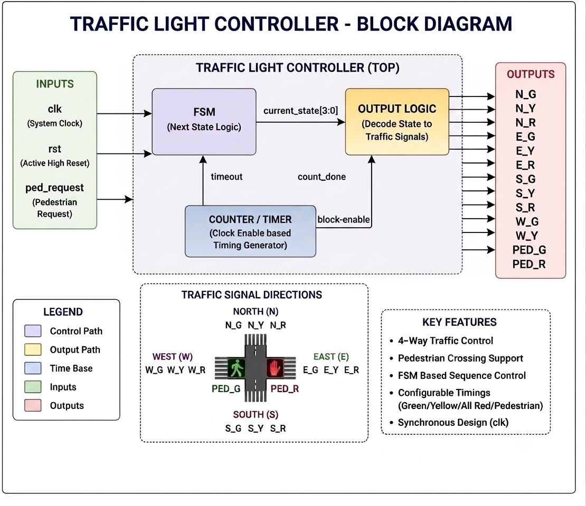
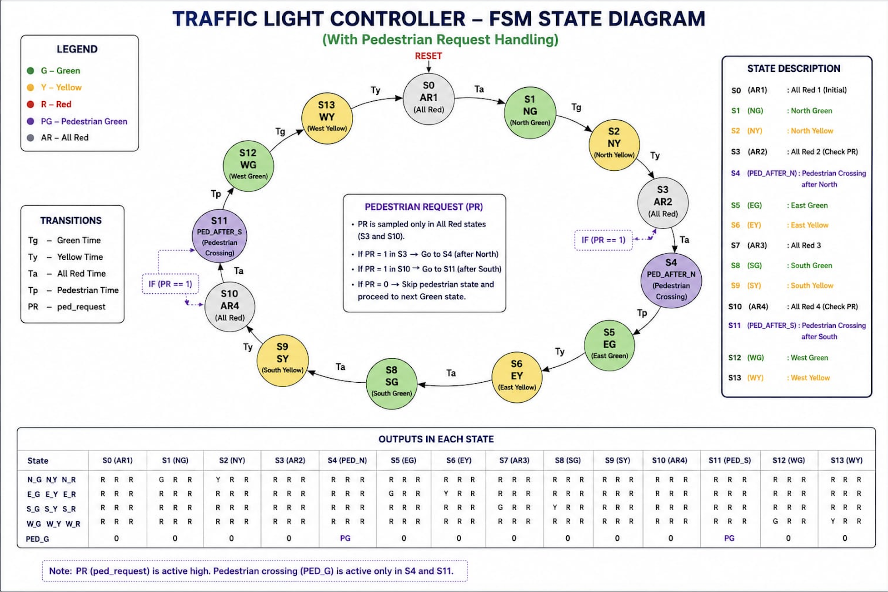
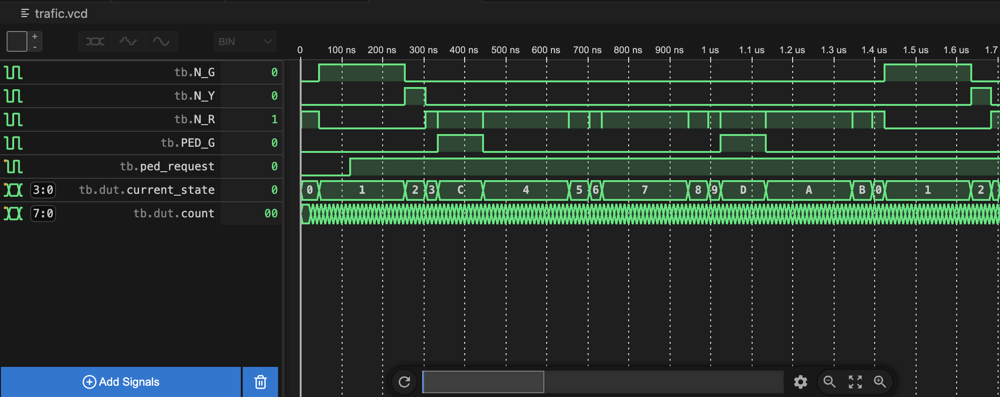

# 🚦 Traffic Light Controller (Verilog HDL)

A Finite State Machine (FSM) based Traffic Light Controller designed in Verilog HDL with pedestrian crossing support.

## Features

- Four-way traffic signal control
- Pedestrian crossing request
- FSM-based architecture
- Configurable green/yellow/red timing
- Synchronous design
- Complete testbench
- GTKWave simulation support

---

## Project Structure

```
Traffic-Light-Controller
│
├── RTL
│   └── traffic_light_controller.v
│
├── Testbench
│   └── tb_design.v
│
├── Images
│   ├── block_diagram.png
│   ├── state_diagram.png
│   └── waveform.png
│
├── README.md
└── .gitignore
```


## FSM States

| State | Description |
|-------|-------------|
| AR1 | All Red |
| NG | North Green |
| NY | North Yellow |
| AR2 | All Red |
| PED_AFTER_N | Pedestrian Crossing |
| EG | East Green |
| EY | East Yellow |
| AR3 | All Red |
| SG | South Green |
| SY | South Yellow |
| AR4 | All Red |
| PED_AFTER_S | Pedestrian Crossing |
| WG | West Green |
| WY | West Yellow |


## Block Diagram




## State Diagram




## Simulation Waveform




## Tools Used
- Verilog HDL
- Icarus Verilog
- GTKWave
- Visual Studio Code
- Git & GitHub

## Simulation

Compile:

iverilog -o traffic RTL/traffic_light_controller.v Testbench/tb_design.v

Run:

vvp traffic


Open GTKWave:

gtkwave trafic.vcd


## Future Improvements

- Emergency vehicle priority
- Vehicle sensor based timing
- Day/Night mode
- Parameterized timings
- FPGA implementation

## Author

**Saicharan A**